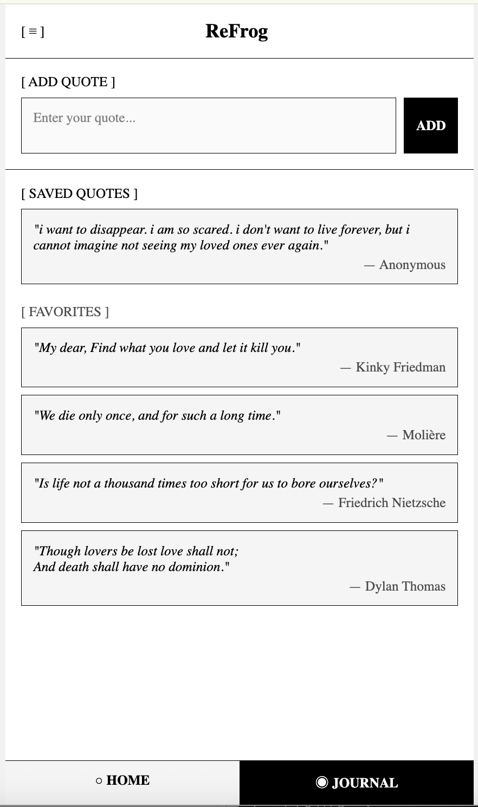

# ReFrog

A terminal-inspired quote journal app with a minimalist aesthetic.




## Features

- **Daily Quotes**: Random philosophical quotes to contemplate
- **Custom Quotes**: Add your own quotes to the rotation
- **Favorites**: Save favorite quotes to your journal
- **Notifications**: Schedule daily reminder quotes
- **Book Shelf**: Organize quotes by book (coming soon)

## Design

ReFrog uses a terminal-inspired aesthetic with:
- Monospace font (XanhMono)
- High contrast black/white theme
- Square bracket UI elements
- Minimalist layout

## Tech Stack

- React Native / Expo
- Expo Router
- AsyncStorage for persistence

## Development

```bash
npm install
npx expo start
```

## License

MIT
